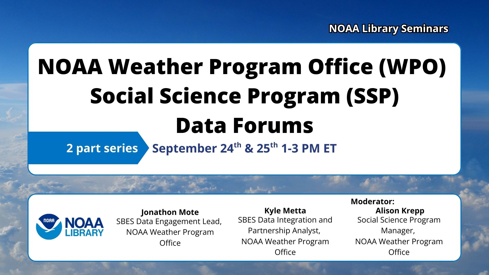

# SSP Data Forums: Building a Connected, Data-Capable SBES Community

---

## 📢 About the Forums

Welcome to the **first annual SSP Data Forums**, an effort of the Social Science Program at **NOAA's Weather Program Office (WPO)**!  
These virtual sessions are the starting point for building a more connected, collaborative, and data-capable **Social, Behavioral, and Economic Sciences (SBES)** community within NOAA and across our partners.  

🗓 **When:** September 24 & 25, 2025 (1-3 PM ET) 
💻 **Where:** Virtual (Vimeo)  
🎯 **Focus:** Metadata standards, data integration tools, and fostering sustained community engagement.

---

## 📅 Forum Details

| **Forum 1**   *September 24 – All About Metadata* | **Forum 2**   *September 25 – From Metadata to Insights* |
| --- | --- |
| **Objectives**   1. Introduce and apply draft metadata standards    2. Highlight how metadata supports discovery, interoperability, and reuse    3. Provide hands-on metadata application using Jupyter notebooks    4. Gather feedback to refine standards | **Objectives**   1. Demonstrate reuse of SBES data alongside weather/climate datasets    2. Walk through a reproducible, transparent workflow in a Jupyter notebook    3. Encourage adoption of integration-ready data practices |

---
## 📝 Registration

The Data Forums will be hosted on **Vimeo**.  
Please register here: [**Link Forthcoming**](https://library.noaa.gov/seminars) to receive event access details.

---

## 📝 Code of Conduct

We are committed to creating a welcoming, inclusive environment for all participants.  
Please review our [**Code of Conduct**](code-of-conduct.md) to understand the community guidelines for the SSP Data Forums.

---

## 📓 Jupyter Notebooks

A key part of the Data Forums is the use of **[Jupyter Notebooks](https://jupyter.org)** — a browser-based tool for producing computational narratives that combine:

- Code execution  
- Text & documentation  
- Mathematical notation  
- Images & videos  

Jupyter is a **powerful open-source tool** for scientific computing, reproducible research, and teaching data science.

Come join others in the **weather and hazard social science community** to explore these tools and apply them to your own work.

---

## 📂 Site Navigation

Use the **Table of Contents** on the left to explore resources and materials.
