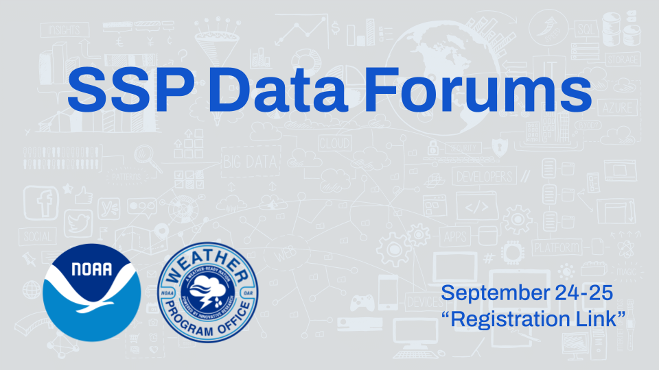

# SSP Data Forums

## About the Forums

More intro language needed.

## Jupyter Books

A key part of the Data Forums is the use of [Jupyter notebooks](https://jupyter.org), a web application for producing computational narratives  Jupyter Notebooks are browser applications which run code and renders text, mathematical notation, images and videos. Jupyter notebook is a powerful open source tool for scientific computing, reproducible research and teaching data science.

Come join others in weather/hazard social science community to learn more about these tools and how to use them!

## Registration

The Data Forums will be hosted on Vimeo.  Please register at [Link Forthcoming]((https://library.noaa.gov/seminars) to join us!

## Detail on the Forums

Forum 1 - Metada
Forum 2 - Data Fusion

## Site Navigation

Look at the table of contents on the left
